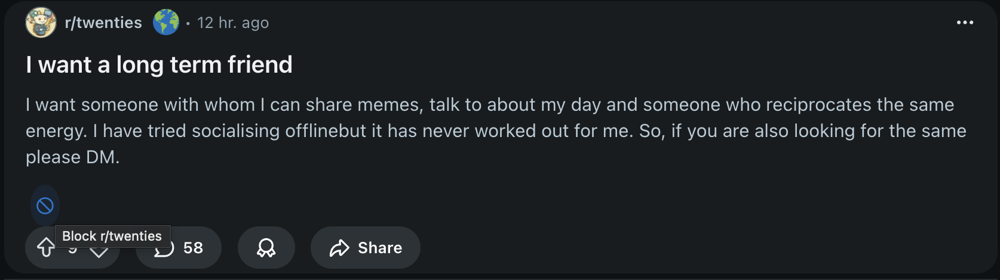
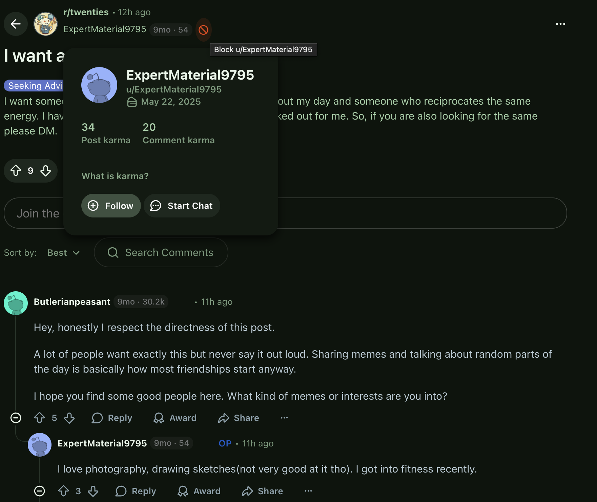
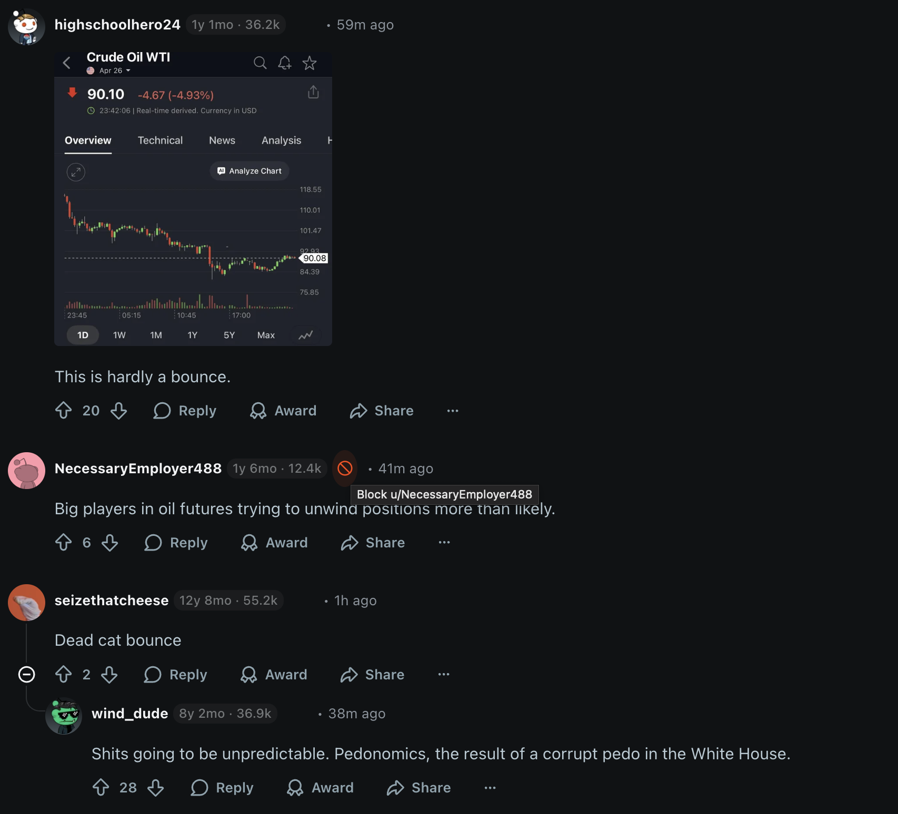
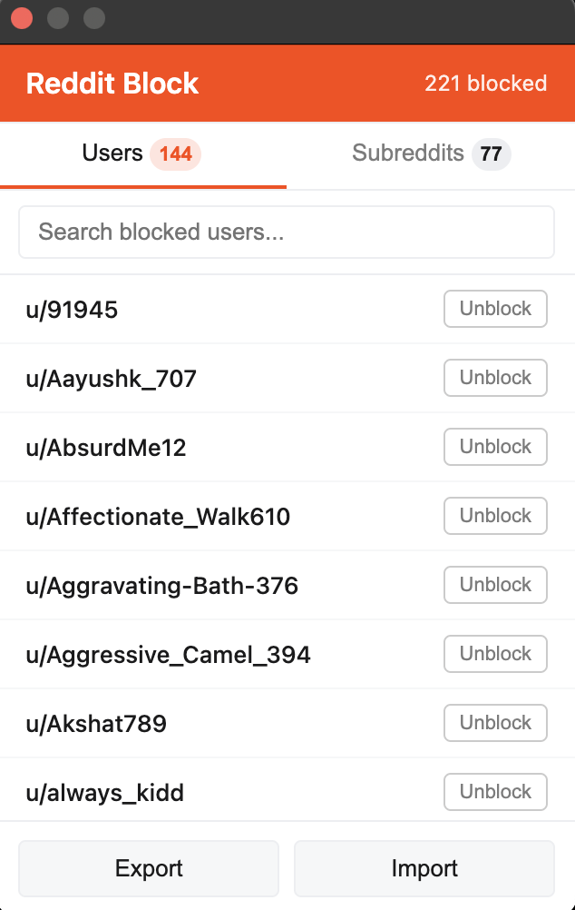

# Reddit Block

A Chrome/Chromium extension that adds one-click block buttons to Reddit for both users and subreddits. Instantly cleans up your feed.

## Demo

https://github.com/user-attachments/assets/6ae3cb97-e395-4591-a399-22cda57e645c

## Features

- **Block users** — one-click block button next to every username in posts and comments
- **Block subreddits** — block button next to subreddit names in the feed
- **Account age + karma badges** — see how old each account is and their karma at a glance for quick bot detection
- **Real Reddit blocking** — actually calls Reddit's block/filter APIs, not just cosmetic hiding
- **Instant CSS hiding** — blocked content disappears immediately, no page reload needed
- **Badge count** — extension icon shows total number of blocked users + subreddits
- **Popup manager** — view, search, and unblock from the extension popup
- **Export/Import** — backup and restore your blocklists as JSON
- **Cross-device sync** — blocklists sync via `chrome.storage.sync` across devices
- **Self-block protection** — won't show block button next to your own username
- **SPA-aware** — works with Reddit's infinite scroll and client-side navigation

## Screenshots

### Block subreddits from feed

### Block users from post view

### Account age and karma badges in comments

### Block confirmation

### Popup manager (144 users, 77 subreddits blocked)

## Account Age Badges

Every username gets a colored badge showing account age and total karma:

| Badge Color | Meaning |
|---|---|
| Red | Account < 30 days old (likely bot/throwaway) |
| Orange | Account < 6 months old |
| Gray | Established account (6+ months) |

## How It Works

| Action | Method | Details |
|---|---|---|
| Block user | `POST /api/block_user/` | OAuth API via background worker |
| Mute subreddit (home feed) | `POST /svc/shreddit/graphql` | GraphQL from content script |
| Filter subreddit (r/all) | `PUT /api/filter/` | OAuth API via background worker |
| Instant hide | CSS `display: none` | Immediate, before API completes |
| Account age | `GET /user/{name}/about.json` | Cached in-memory for 1 hour |

## Install

1. Clone or download this repo
2. Open `chrome://extensions/` (or your Chromium browser's equivalent)
3. Enable **Developer mode**
4. Click **Load unpacked** and select the `Reddit_Block` folder
5. Navigate to reddit.com — block buttons appear next to usernames and subreddit names

## Permissions

- `storage` — persist blocklists across sessions
- `cookies` — read `token_v2` for Reddit API authentication
- Host permissions for `reddit.com` and `oauth.reddit.com`

## License

MIT
